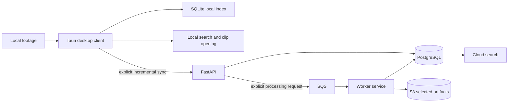

# Architecture overview

## System boundary



The desktop client is useful without the network. The cloud is an optional shared knowledge and processing layer, not a replacement for the user’s archive.

## Data ownership

| Data | Local machine | Cloud |
| --- | --- | --- |
| Original footage | source of truth | absent by default |
| Local file paths | source of truth for that machine | never trusted as global identity |
| SQLite index | machine-local cache/index | absent |
| Project and MediaAsset identity | local reference | shared source of truth |
| Metadata | fast local copy | shared canonical project knowledge |
| Transcripts, tags, embeddings | optional local cache | shared analysis results |
| Job state | request/cache view | canonical state |
| Thumbnails and previews | local cache | selected artifacts only |

## Content identity

A path is not a durable identity because the same file can move between disks or machines. A content hash is the stable identity of a logical MediaAsset.

```text
Laptop A: D:/Shoot/Day1/A001_C003.mp4
Laptop B: E:/Backup/Day1/A001_C003.mp4
Content:  the same SHA-256
```

The local database stores multiple `local_files` rows that can point to one
logical `media_assets` row. Its versioned SQLite schema keeps paths as
locations, preserves missing history, and treats a warning-bearing scan as
incomplete so an interrupted hash cannot cause a false deletion. The concrete
hashing and re-indexing policy is documented in
[docs/local-index.md](local-index.md).

## Synchronization

Sync is explicit and incremental:

- the client sends changes since a cursor/version;
- the server validates ownership and payloads;
- idempotency keys make retries safe;
- the server returns the next cursor;
- network loss resumes from the last durable cursor;
- stale cursors or conflicts become actionable states.

A sync request must never use a client path as permission or identity input.

## Asynchronous processing

The desktop app creates an explicit request only for selected clips and operations. The backend stores job state and publishes durable work to SQS. Workers claim jobs, produce idempotent outputs, retry transient failures, and record human-readable permanent failures.

The initial state machine is:

```text
PENDING -> QUEUED -> PROCESSING -> COMPLETED
                         |
                         +-------> FAILED -> retry or dead-letter
```

Duplicate delivery is expected and must not corrupt outputs.

## Search strategy

Implement deterministic search first:

- file name and text metadata;
- date, folder, resolution, FPS, duration, codec;
- PostgreSQL full-text search after sync.

Semantic search and pgvector are a later layer. They must not replace deterministic filters or make basic local search dependent on cloud availability.

## Security and reliability boundaries

- cloud APIs are private by default;
- authentication is paired with object-level authorization;
- IAM roles are least-privilege;
- desktop binaries contain no long-lived cloud credentials;
- signed URLs are short-lived;
- file types and sizes are validated before processing;
- logs contain traceable operation and job IDs;
- worker shutdown and retry behavior are tested;
- local functionality remains useful during cloud failures.

## Scaling story

The system scales by separating cheap local deterministic work, shared project state, and expensive explicit jobs. It can begin on one laptop, then add multiple clients, a PostgreSQL-backed project model, durable queues, workers, and managed AWS services without changing the meaning of a media asset.
